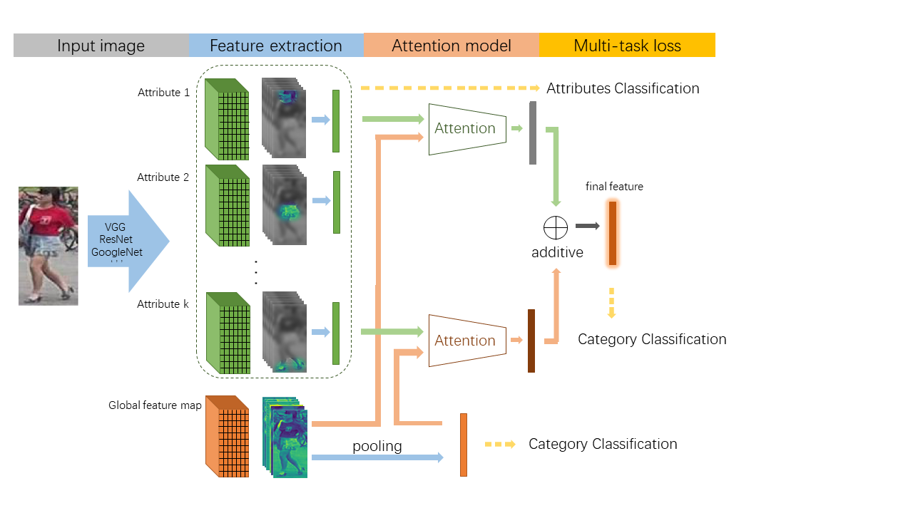

## Attribute-Aware Attention Model
Code for paper: Attribute-Aware Attention Model for Fine-grained Representation Learning



### Usage
Requires: Keras 1.2.1 with Theano backend

1. Download CUB-200-2011 dataset [here](http://www.vision.caltech.edu/visipedia/CUB-200-2011.html) and unzip it to `$CUB`; Change `data_dir` in `cub_demo.py` to `$CUB`.

2. `sh cub_run.sh`

Result on CUB dataset


### Citation

Please use the following bibtex to cite our work:
```
@inproceedings{a3m_2018_kai,
  author = {Kai Han and Jianyuan Guo and Chao Zhang and Mingjian Zhu},
  title = {Attribute-Aware Attention Model for Fine-grained Representation Learning},
  year = {2018},
  booktitle = {ACM Multimedia Conference}
  }
```
