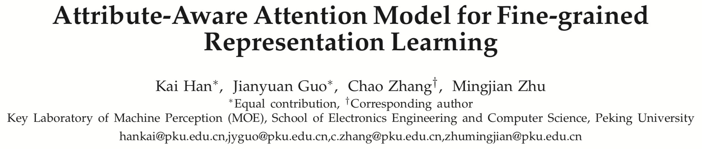
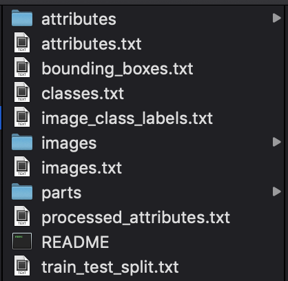
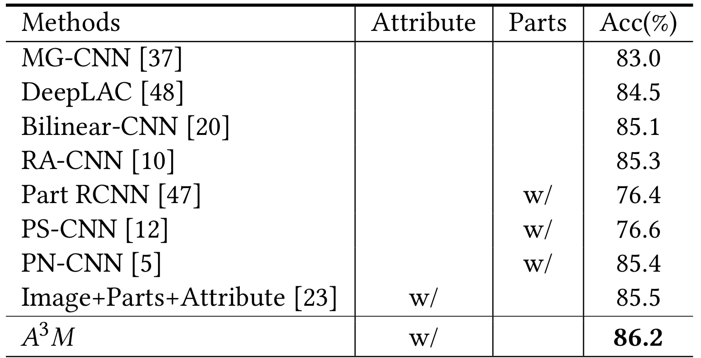

## Attribute-Aware Attention Model
Code for ACM Multimedia 2018 oral paper: Attribute-Aware Attention Model for Fine-grained Representation Learning



We have presented results of **fine-grained classification**, **person re-id**, **image retrieval** tasks, including CUB-200-2011, Market-1501, CARS196 datasets in the paper. Here is the example of fine-grained classification. For detailed results, refer to the [original paper](https://dl.acm.org/citation.cfm?id=3240550) or [ArXiv](https://arxiv.org/abs/1901.00392).


### Usage
Requires: Keras 1.2.1 ("image_data_format": "channels_first")

Run in two steps:

1. Download CUB-200-2011 dataset [here](http://www.vision.caltech.edu/visipedia/CUB-200-2011.html) and unzip it to `$CUB`; Copy file `tools/processed_attributes.txt` to `$CUB`.

- The `$CUB` dir should be like this:


2. Change `data_dir` in `run.sh` to `$CUB`, run the scprit `sh run.sh` to obtain the result.

- Result on CUB dataset




### Citation
Please use the following bibtex to cite our work:
```
@inproceedings{han2018attribute,
  title={Attribute-Aware Attention Model for Fine-grained Representation Learning},
  author={Han, Kai and Guo, Jianyuan and Zhang, Chao and Zhu, Mingjian},
  booktitle={Proceedings of the 26th ACM international conference on Multimedia},
  pages={2040--2048},
  year={2018},
  organization={ACM}
}
```
